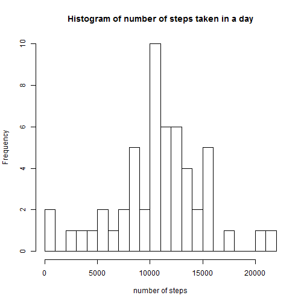
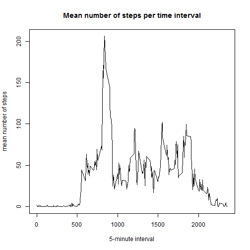
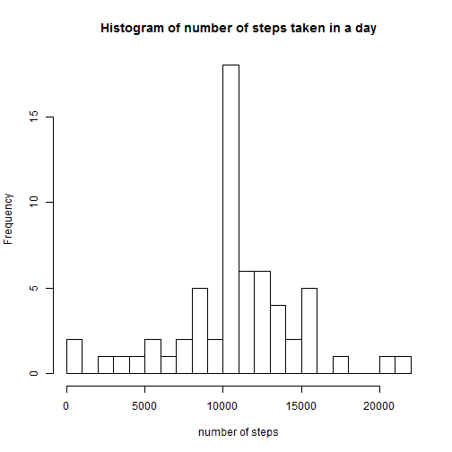
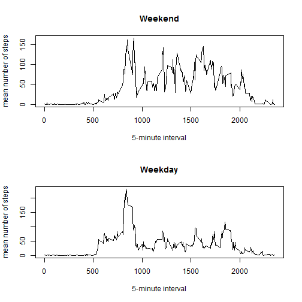

# Loading and preprocessing the data

The code below loads the data into an object named `activity`.


```r
activity<-read.csv("activity.csv")
```

# What is mean total number of steps taken per day?

### 1. Calculate the total number of steps taken per day

The object `activity_sum` contains an aggregated table which sums the number of steps each day.


```r
activity_sum<-aggregate(activity$steps, by=list(activity$date), FUN=sum)
names(activity_sum)<-c("date", "steps")
activity_sum
```

```
##          date steps
## 1  2012-10-01    NA
## 2  2012-10-02   126
## 3  2012-10-03 11352
## 4  2012-10-04 12116
## 5  2012-10-05 13294
## 6  2012-10-06 15420
## 7  2012-10-07 11015
## 8  2012-10-08    NA
## 9  2012-10-09 12811
## 10 2012-10-10  9900
## 11 2012-10-11 10304
## 12 2012-10-12 17382
## 13 2012-10-13 12426
## 14 2012-10-14 15098
## 15 2012-10-15 10139
## 16 2012-10-16 15084
## 17 2012-10-17 13452
## 18 2012-10-18 10056
## 19 2012-10-19 11829
## 20 2012-10-20 10395
## 21 2012-10-21  8821
## 22 2012-10-22 13460
## 23 2012-10-23  8918
## 24 2012-10-24  8355
## 25 2012-10-25  2492
## 26 2012-10-26  6778
## 27 2012-10-27 10119
## 28 2012-10-28 11458
## 29 2012-10-29  5018
## 30 2012-10-30  9819
## 31 2012-10-31 15414
## 32 2012-11-01    NA
## 33 2012-11-02 10600
## 34 2012-11-03 10571
## 35 2012-11-04    NA
## 36 2012-11-05 10439
## 37 2012-11-06  8334
## 38 2012-11-07 12883
## 39 2012-11-08  3219
## 40 2012-11-09    NA
## 41 2012-11-10    NA
## 42 2012-11-11 12608
## 43 2012-11-12 10765
## 44 2012-11-13  7336
## 45 2012-11-14    NA
## 46 2012-11-15    41
## 47 2012-11-16  5441
## 48 2012-11-17 14339
## 49 2012-11-18 15110
## 50 2012-11-19  8841
## 51 2012-11-20  4472
## 52 2012-11-21 12787
## 53 2012-11-22 20427
## 54 2012-11-23 21194
## 55 2012-11-24 14478
## 56 2012-11-25 11834
## 57 2012-11-26 11162
## 58 2012-11-27 13646
## 59 2012-11-28 10183
## 60 2012-11-29  7047
## 61 2012-11-30    NA
```

### 2.  Make a histogram of the total number of steps taken each day

The histogram indicates the number of days (frequency) in which the subject took a number of steps within each range specific in the x-axis.


```r
hist(activity_sum$steps, breaks=20, main="Histogram of number of steps taken in a day", xlab="number of steps")
```

 

### 3. Calculate and report the mean and median of the total number of steps taken per day

The code below calculates the mean and median number of steps taken across all dates.


```r
activity_mean<-mean(activity_sum$steps, na.rm=TRUE)
activity_median<-median(activity_sum$steps, na.rm = TRUE)
cat("The mean is", activity_mean)
```

```
## The mean is 10766.19
```

```r
cat("The median is", activity_median)
```

```
## The median is 10765
```

# What is the average daily activity pattern?

### 1. Make a time series plot of the 5-minute interval (x-axis) and the average number of steps taken, averaged across all days (y-axis)

The object `activity_interval` aggregates the mean number of steps taken at each interval across all days.


```r
activity_interval<-aggregate(activity$steps, by=list(activity$interval), FUN=mean, na.rm=TRUE)
names(activity_interval)<-c("interval", "steps")
plot(activity_interval$interval, activity_interval$steps, type="l", xlab = "5-minute interval", ylab = "mean number of steps", main="Mean number of steps per time interval")
```

 

### 3. Which 5-minute interval, on average across all the days in the dataset, contains the maximum number of steps?


```r
max_steps<-max(activity_interval$steps)
max_interval<-activity_interval$interval[activity_interval$steps==max_steps]
cat("The maximum mean number of steps is ", max_steps, ", which occurs at interval ", max_interval)
```

```
## The maximum mean number of steps is  206.1698 , which occurs at interval  835
```

# Imputing missing values

### 1. Calculate and report the total number of missing values in the dataset.


```r
NA_count<-sum(is.na(activity$steps))
cat("There are ", NA_count, "NAs in the dataset.")
```

```
## There are  2304 NAs in the dataset.
```
 
### 2. Devise a strategy for filling in all of the missing values in the dataset.
 
Missing values will be replaced with the mean number of steps taken during the interval across all days (i.e. the values found in `activity_interval`).

### 3. Create a new dataset that is equal to the original dataset but with the missing data filled in.

A duplicated dataset is created as `new_activity` and editted so NA values are replaced by the mean value of the interval across all days.


```r
new_activity<-activity
for (i in 1:nrow(new_activity)) {
    if (is.na(new_activity$steps[i])) {
        new_activity$steps[i]<-activity_interval$steps[activity_interval$interval==new_activity$interval[i]]
    }
}
```

### 4. Make a histogram of the total number of steps taken each day and Calculate and report the mean and median total number of steps taken per day. Do these values differ from the estimates from the first part of the assignment? What is the impact of imputing missing data on the estimates of the total daily number of steps?

The original analysis is repeated using the new dataset.


```r
new_activity_sum<-aggregate(new_activity$steps, by=list(new_activity$date), FUN=sum)
names(new_activity_sum)<-c("date", "steps")
hist(new_activity_sum$steps, breaks=20, main="Histogram of number of steps taken in a day", xlab="number of steps")
```

 

```r
new_activity_mean<-mean(new_activity_sum$steps, na.rm=TRUE)
new_activity_median<-median(new_activity_sum$steps, na.rm = TRUE)
cat("The mean is", new_activity_mean)
```

```
## The mean is 10766.19
```

```r
cat("The median is", new_activity_median)
```

```
## The median is 10766.19
```

# Are there differences in activity patterns between weekdays and weekends?

### 1. Create a new factor variable in the dataset with two levels - "weekday" and "weekend" indicating whether a given date is a weekday or weekend day.

A `new_activity$weekday` column identifies the date as a weekday or weekend.


```r
new_activity$date<-as.Date(new_activity$date)
new_activity$weekday<-weekdays(new_activity$date)
for (i in 1:nrow(new_activity)) {
    if (new_activity$weekday[i]=="Saturday") {
        new_activity$weekday[i]<-"weekend"
    }
    else if (new_activity$weekday[i]=="Sunday") {
        new_activity$weekday[i]<-"weekend"
    }
    else {
        new_activity$weekday[i]<-"weekday"
    }
}
```

### 2. Make a panel plot containing a time series plot (i.e. type = "l") of the 5-minute interval (x-axis) and the average number of steps taken, averaged across all weekday days or weekend days (y-axis).


```r
new_activity_weekend<-new_activity[new_activity$weekday=="weekend",]
new_activity_weekday<-new_activity[new_activity$weekday=="weekday",]
new_activity_weekend_interval<-aggregate(new_activity_weekend$steps, by=list(new_activity_weekend$interval), FUN=mean, na.rm=TRUE)
names(new_activity_weekend_interval)<-c("interval", "steps")
new_activity_weekday_interval<-aggregate(new_activity_weekday$steps, by=list(new_activity_weekday$interval), FUN=mean, na.rm=TRUE)
names(new_activity_weekday_interval)<-c("interval", "steps")
par(mfrow=c(2,1))
plot(new_activity_weekend_interval$interval, new_activity_weekend_interval$steps, type="l", xlab = "5-minute interval", ylab = "mean number of steps", main="Weekend")
plot(new_activity_weekday_interval$interval, new_activity_weekday_interval$steps, type="l", xlab = "5-minute interval", ylab = "mean number of steps", main="Weekday")
```

 

